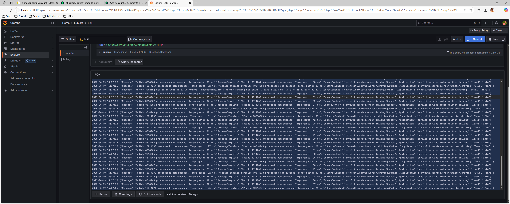
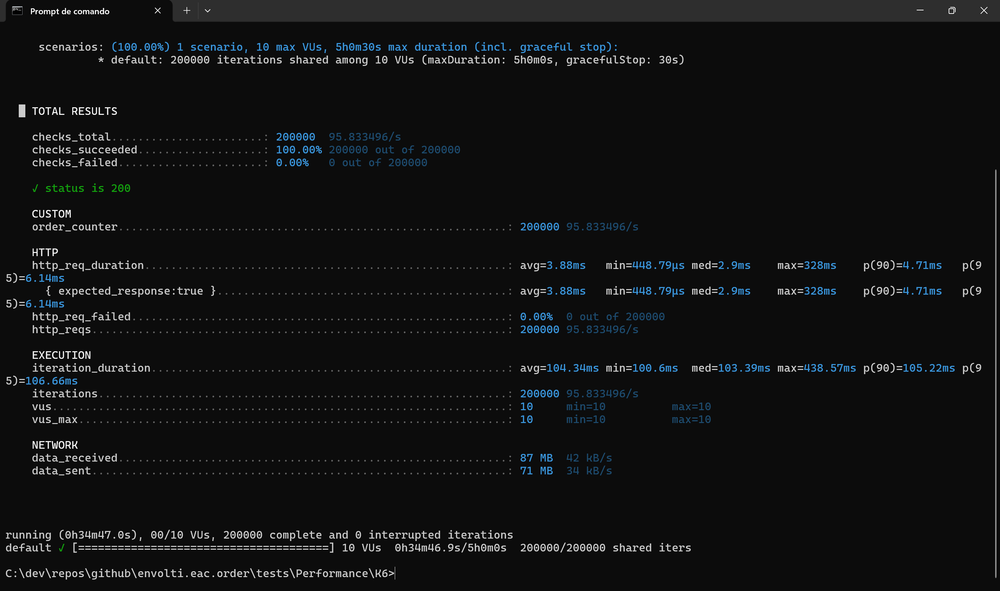
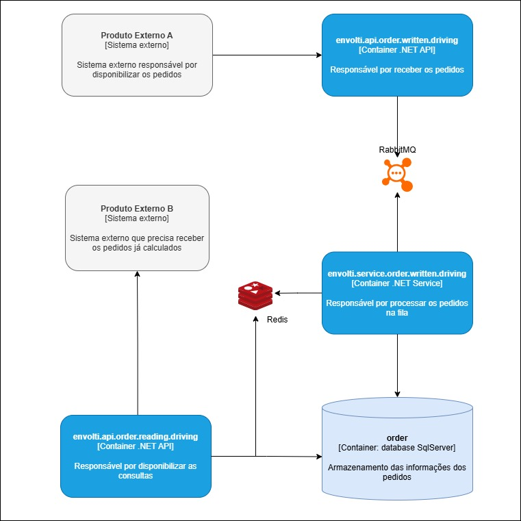

# envolti.eac.order

# Eac
Engineering, Architecture and Construction

# Sobre o ambiente ambiente

O ambiente utiliza recursos externos como ferramentas para auxiliar no proprosito da aplicação sendo eles:

- RabbitMQ
- Redis
- Grafana
- Loki
- Promtail
- MongoDb

## Ambiente docker

### Docker-compose
```
docker-compose up -d
```

> [!NOTE]
> A estrutura do banco de dados executa automaticamente a [Migration].

## Executar os projetos

* envolti.api.order.reading.driving
* envolti.api.order.written.driving
* envolti.service.order.written.driving

## Instruções de uso

### Exemplo de requisição GET
```
  Obter todos os pedidos
  http://localhost:8084/api/order/getall

  Obter pedidos filtrando por status
  http://localhost:8084/api/order/GetByStatus

  Obter pedido filtrando por Id
  http://localhost:8084/api/order/PEDIDOID
```

### Exemplo de requisição GET
```
{
    "orderIdExternal": 7000000,
    "totalPrice": 185.48,
    "createdAt": "2025-06-18T19:51:47.4055155+00:00",
    "processedIn": "2025-06-18T19:51:47.4062668+00:00",
    "status": 1,
    "products": [
        {
            "productIdExternal": 1354,
            "name": "Produto 1",
            "price": 15.9
        },
        {
            "productIdExternal": 6599,
            "name": "Produto 2",
            "price": 102.99
        },
        {
            "productIdExternal": 5536,
            "name": "Produto 3",
            "price": 66.59
        }
    ]
}
```

### Exemplo de requisição POST
```
{
  "orderIdExternal": 1,
  "products": [
    {
      "productIdExternal": 1354,
      "name": "Produto 1",
      "price": 15.90
    },
    {
      "productIdExternal": 6599,
      "name": "Produto 2",
      "price": 102.99
    },
    {
      "productIdExternal": 5536,
      "name": "Produto 3",
      "price": 66.59
    }
  ]
}
```

### Tempo de requisição POST



### Tempo de requisição GET
- Tempo total da requisições por status dos pedidos: 3 ms
- Tempo total da requisições por todos os pedidos: 3 ms
- Tempo total da requisições do pedido por Id: 3 ms

### Exemplo de performance

Rodar 200 mil requisições por dia (ou ~2,3 requisições por segundo em média)



### Desenho da Arquitetura


